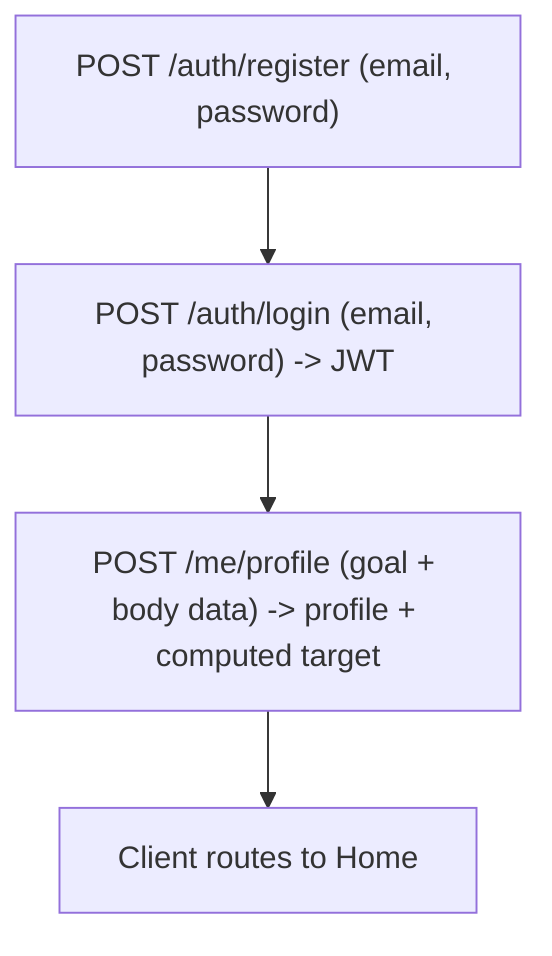

# User Service — 01. Onboarding User

> **Status:** draft for review (contract-first; service + tests follow this spec).
> **Module:** `user` (schema `"user"`) · **Clients:** Flutter (User role).
> **Traces:** BRD USR-1, USR-2, USR-3, USR-4, USR-6 · ERD §2, §4.1–4.3, §5 · user-flows U3→U4→U5.
> Shared conventions (envelope, auth header, error codes, `/api/v1` prefix): see
> `../README.md`.

## Overview

The onboarding flow turns a new visitor into a usable account with a personalized daily
calorie **target**. It spans three endpoints, in order:

1. **Register** — create an account from email + password (role defaults to `user`). (USR-1, USR-6)
2. **Login** — exchange credentials for a JWT. (USR-2)
3. **Create Profile** — submit body data + goal; the server computes & returns the daily
   target (Mifflin-St Jeor → TDEE → goal adjustment). (USR-3, USR-4)



- **Actor:** an unauthenticated new user (becomes authenticated after step 2).
- **Preconditions:** none for register/login; step 3 requires a valid JWT.
- **Postcondition:** one row in `"user".users` (role `user`), one row in `"user".user_profile`
  (1:1), and the client holds a JWT.
- **Privacy:** the profile is created for the **token's own user only**. There is no
  "create profile for another user" in this flow.

---

## Endpoint 1 — Register

`POST /auth/register` · **Auth:** none

Creates a new user account. The role is always assigned the seeded `user` role (USR-6);
admin accounts are provisioned separately and are out of scope here.

### Request
Headers: `Content-Type: application/json`

```jsonc
{
  "email": "andi@example.com",
  "password": "s3curePass",
  "confirmPassword": "s3curePass"
}
```

| Field | Type | Rules |
|---|---|---|
| `email` | string | required; valid email; max 255; stored lowercased; **unique** |
| `password` | string | required; min 8, max 72 (bcrypt input limit); not equal to email |
| `confirmPassword` | string | required; must equal `password` |

### Success — `201 Created`
Returns the created account (never the password/hash). Does **not** auto-login (client
calls login next, matching U3 → U4).

```jsonc
{
  "success": true,
  "data": {
    "id": "0192f5c1-7b3a-7e2a-8a01-9f1a2b3c4d5e",
    "email": "andi@example.com",
    "role": "user",
    "createdAt": "2026-10-09T20:16:22Z"
  }
}
```

### Errors
| Condition | HTTP | `error.code` |
|---|---|---|
| Missing/invalid field, weak password, or `confirmPassword` mismatch | 400 | `VALIDATION_ERROR` |
| Email already registered | 409 | `CONFLICT` |

> Note: email uniqueness is checked against **active and soft-deleted** users — a
> deactivated account still owns its email (admin can reactivate). This is a design rule
> for the service to honor.

---

## Endpoint 2 — Login

`POST /auth/login` · **Auth:** none

Verifies credentials and issues a JWT. (USR-2)

### Request
```jsonc
{ "email": "andi@example.com", "password": "s3curePass" }
```

| Field | Type | Rules |
|---|---|---|
| `email` | string | required; valid email |
| `password` | string | required |

### Success — `200 OK`
```jsonc
{
  "success": true,
  "data": {
    "token": "<jwt>",
    "tokenType": "Bearer",
    "expiresIn": 86400,
    "user": {
      "id": "0192f5c1-7b3a-7e2a-8a01-9f1a2b3c4d5e",
      "email": "andi@example.com",
      "role": "user",
      "hasProfile": false
    }
  }
}
```

- `expiresIn` is seconds (from `JWT_TTL_HOURS`). JWT claims include subject = user id and
  `role`.
- `hasProfile` lets the client decide: `false` → go to Onboarding (U4/U5); `true` → Home.

### Errors
| Condition | HTTP | `error.code` |
|---|---|---|
| Missing/invalid field | 400 | `VALIDATION_ERROR` |
| Unknown email **or** wrong password | 401 | `UNAUTHENTICATED` |
| Account is deactivated (soft-deleted) | 401 | `UNAUTHENTICATED` |

> Unknown-email and wrong-password return the **same** `401 UNAUTHENTICATED` with an
> identical message (no account enumeration).

---

## Endpoint 3 — Create Profile

`POST /me/profile` · **Auth:** `Bearer <JWT>` (role `user`)

Creates the caller's 1:1 profile from goal + body data, then computes and returns the
daily calorie target. (USR-3, USR-4) The profile is always for the **token's own user**;
there is no user id in the path or body.

### Request
Headers: `Authorization: Bearer <jwt>`, `Content-Type: application/json`

```jsonc
{
  "goal": "lose",
  "weightKg": 72.5,
  "heightCm": 175,
  "age": 29,
  "sex": "male",
  "activityLevel": "moderate"
}
```

| Field | Type | Rules (CHECK-mirrored from ERD §4.3) |
|---|---|---|
| `goal` | string | required; one of `lose` \| `maintain` \| `gain` |
| `weightKg` | number | required; > 0, ≤ 500; up to 2 decimals |
| `heightCm` | number | required; > 0, ≤ 300; up to 2 decimals |
| `age` | integer | required; > 0 and < 150 |
| `sex` | string | required; one of `male` \| `female` |
| `activityLevel` | string | required; one of `sedentary` \| `light` \| `moderate` \| `active` \| `very_active` |

### Success — `201 Created`
Returns the saved profile plus the computed target breakdown (so the client can show it
immediately on Home, U5 → U6).

```jsonc
{
  "success": true,
  "data": {
    "profile": {
      "id": "0192f5c1-80aa-7111-9bb2-0c0ddee11223",
      "userId": "0192f5c1-7b3a-7e2a-8a01-9f1a2b3c4d5e",
      "goal": "lose",
      "weightKg": 72.5,
      "heightCm": 175,
      "age": 29,
      "sex": "male",
      "activityLevel": "moderate",
      "createdAt": "2026-10-09T20:20:00Z",
      "updatedAt": "2026-10-09T20:20:00Z"
    },
    "target": {
      "bmr": 1678.75,
      "tdee": 2602.06,
      "dailyCalorieTarget": 2102.06,
      "formula": "mifflin_st_jeor"
    }
  }
}
```

### Target computation (authoritative — ERD §5)
Server computes, does **not** trust any client-sent target:

1. **BMR (Mifflin-St Jeor):**
   - male: `10·weightKg + 6.25·heightCm − 5·age + 5`
   - female: `10·weightKg + 6.25·heightCm − 5·age − 161`
2. **TDEE = BMR × activity multiplier:**
   `sedentary 1.2 · light 1.375 · moderate 1.55 · active 1.725 · very_active 1.9`
3. **Goal adjustment:** `lose = TDEE − 500` · `maintain = TDEE` · `gain = TDEE + 300`
   → `dailyCalorieTarget`.

> Worked example (the one in the success body): male, 72.5 kg, 175 cm, 29 y, moderate,
> lose → BMR = 10·72.5 + 6.25·175 − 5·29 + 5 = **1678.75** → TDEE = 1678.75 × 1.55 =
> 2602.0625 → target = TDEE − 500 = 2102.0625. Numbers are rounded to 2 decimals in the
> response (BMR 1678.75, TDEE 2602.06, target 2102.06).

### Errors
| Condition | HTTP | `error.code` |
|---|---|---|
| Missing/invalid field or out-of-range value | 400 | `VALIDATION_ERROR` |
| No/invalid/expired token | 401 | `UNAUTHENTICATED` |
| Token role is not `user` | 403 | `FORBIDDEN` |
| A profile already exists for this user (1:1) | 409 | `CONFLICT` |

> Updating an existing profile (USR-5, recompute target) is a **separate** use case
> (`PUT /me/profile`) documented in a later spec — not part of onboarding.

> **Roadmap (next sprint):** email verification via OTP is intentionally **out of scope**
> for this spec. When added, register will create the user as `pending_verification` and a
> new use case `02. Verify Email.md` (`POST /auth/verify-otp`) will activate the account.
> UAT will use a mock OTP mode (fixed code via config, surfaced in the response) so no real
> email service is needed; prod switches to a real sender by env only. Social login (OAuth)
> is a separate, later concern (not MVP).

---

## Test cases (the suite in `apps/backend/tests/` MUST cover these 1:1)

> IDs are stable so a failing test maps back to a spec line. `TC-ON-*` = Onboarding.

### Register
- **TC-ON-01** register with valid email + matching password → `201`, body has `id`,
  `email` (lowercased), `role: "user"`; no password field present.
- **TC-ON-02** duplicate email → `409 CONFLICT`.
- **TC-ON-03** invalid email format → `400 VALIDATION_ERROR`.
- **TC-ON-04** password shorter than 8 → `400 VALIDATION_ERROR`.
- **TC-ON-05** `confirmPassword` ≠ `password` → `400 VALIDATION_ERROR`.
- **TC-ON-06** email stored/returned lowercased regardless of input casing.
- **TC-ON-07** password is persisted only as a hash (never returned; login works with the
  original plaintext).

### Login
- **TC-ON-08** correct credentials → `200`, returns `token`, `expiresIn`, `user.role=user`,
  `user.hasProfile=false` (right after register).
- **TC-ON-09** wrong password → `401 UNAUTHENTICATED`.
- **TC-ON-10** unknown email → `401 UNAUTHENTICATED` with the **same** message as TC-ON-09.
- **TC-ON-11** issued JWT is accepted by a protected endpoint; its claims carry user id + role.
- **TC-ON-12** deactivated (soft-deleted) account → `401 UNAUTHENTICATED`.

### Create profile
- **TC-ON-13** valid profile → `201`; `target.dailyCalorieTarget` equals the ERD §5
  computation (assert the worked example: male/72.5/175/29/moderate/lose → BMR 1678.75,
  TDEE 2602.06, target 2102.06).
- **TC-ON-14** female formula branch computes correctly (−161 constant).
- **TC-ON-15** each activity level maps to the correct multiplier (parametrized).
- **TC-ON-16** each goal maps to the correct adjustment (lose −500 / maintain 0 / gain +300).
- **TC-ON-17** no token → `401 UNAUTHENTICATED`.
- **TC-ON-18** invalid/expired token → `401 UNAUTHENTICATED`.
- **TC-ON-19** `admin`-role token → `403 FORBIDDEN`.
- **TC-ON-20** second profile for the same user → `409 CONFLICT`.
- **TC-ON-21** out-of-range `age` (e.g. 0 or 200) → `400 VALIDATION_ERROR` (mirrors DB CHECK).
- **TC-ON-22** invalid `sex` / `goal` / `activityLevel` enum value → `400 VALIDATION_ERROR`.
- **TC-ON-23** after a profile exists, login returns `user.hasProfile=true`.

### Unit-level (no HTTP) — pure logic
- **TC-ON-U1** `ComputeTarget` BMR/TDEE/target table matches ERD §5 across a parametrized
  matrix (both sexes × 5 activity levels × 3 goals).
- **TC-ON-U2** password hashing: `Hash` + `Verify` round-trips; wrong password fails verify.
