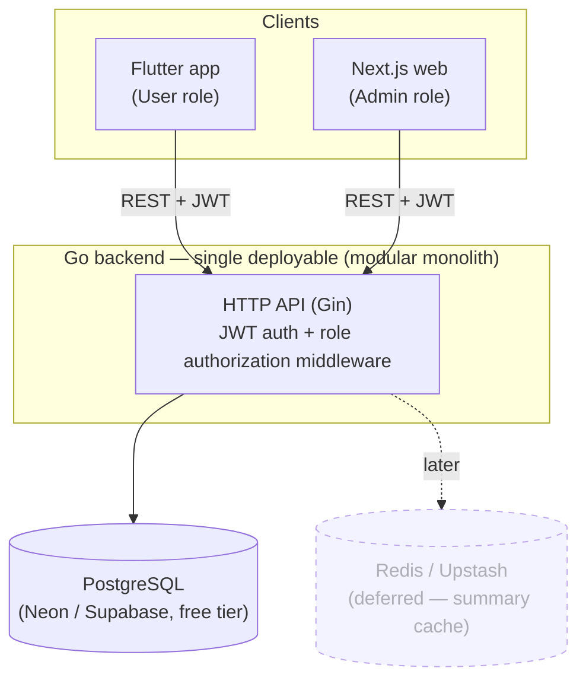
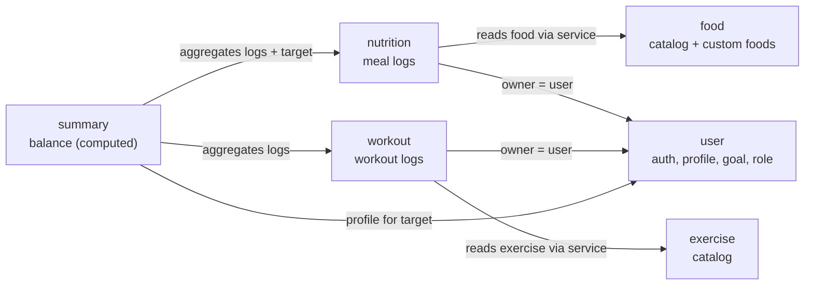
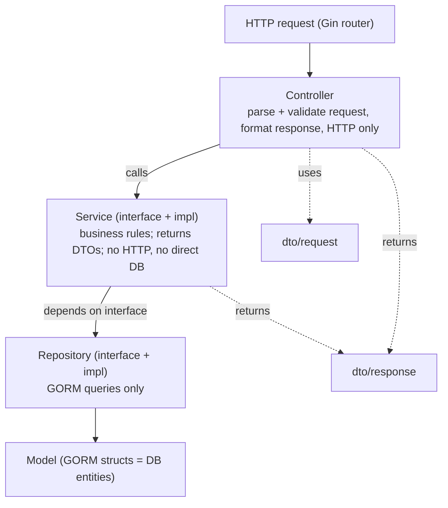

# Architecture — cal-lowrisk

| Field | Value |
|---|---|
| **Project** | cal-lowrisk |
| **Document** | Architecture decisions & system design |
| **Version** | 0.1 (Draft) |
| **Status** | Draft — pending review |
| **Author** | Product Owner + Kiro (SA) |
| **Phase** | System Analysis (follows the BRD; pairs with `erd.md`) |
| **Last updated** | 2026-10-08 |

> **Process note:** This document is the **architecture** half of the SA phase; the
> **data** half is [`erd.md`](./erd.md). Both derive from the BRD
> (`docs/01-business/brd.md`). It records *how the system is structured and why* — the
> decisions a developer needs before writing code. It restates and expands the decisions
> in steering `product.md` and the `add-module` skill; where they overlap, those remain
> the operative source for day-to-day coding.

---

## 1. Architectural style — Modular Monolith

cal-lowrisk is a **modular monolith**: **one deployable backend**, internally divided
into **modules** (bounded contexts) with explicit boundaries. It is *not* microservices,
and *not* a big ball of mud.

### Why (BRD §7, NFR "Cost" + "Extensibility")
- **Cost / free-tier:** one process, one deploy, one managed Postgres — the cheapest thing
  that is still well-structured. Microservices would multiply deploys, networking, and
  ops that a learning MVP does not need.
- **Simplicity:** one codebase, one place to run and debug; no distributed transactions,
  no inter-service network calls to reason about.
- **Extraction path (the key reason over a plain monolith):** modules are isolated enough
  that any one (e.g. `nutrition`) can later be lifted into its own service with minimal
  refactor. We *prepare* that path without *paving* it.

### The three rules that keep it "modular" (not a monolith-in-name)
1. **Module-first layout.** Code is organized by business module, then by layer — not by
   layer globally. (`internal/modules/<module>/...`)
2. **Dependencies flow inward, through interfaces.** Controller → Service → Repository.
   Outer layers depend on inner **interfaces**, enabling DI and testing.
3. **Cross-module access only via another module's Service interface** — never by reaching
   into its repository, model, or tables. This single rule is what makes future extraction
   cheap and keeps boundaries honest.

---

## 2. System context (who talks to what)



- **Two clients, two roles.** Flutter = **User**; Next.js = **Admin**. Both hit the same
  Go API over REST with JWT. There is no separate admin backend — role authorization
  inside the one API enforces who can do what.
- **PostgreSQL** is the single source of truth (see `erd.md`).
- **Redis** is deferred: the `summary` module is designed behind a `Cache` interface so it
  can be added (e.g. Upstash free tier) with no redesign.

---

## 3. Module map (bounded contexts)

Modules mirror the BRD and `erd.md`. Each is a bounded context owning its tables.



| Module | Responsibility | Data kind | Owns tables |
|---|---|---|---|
| `user` | Auth, profile (weight/height/age/sex/activity), goal, role | master (per user) | `role`, `users`, `user_profile` |
| `food` | Food catalog + macros; reusable custom foods | master/reference | `food`, `food_serving` |
| `exercise` | Exercise catalog + unit type + MET | master/reference | `exercise` |
| `nutrition` | Meal logs (catalog or custom food + portion) | transactional | `nutrition_log` |
| `workout` | Workout logs (catalog exercise + amount) | transactional | `workout_log` |
| `summary` | Daily/weekly/monthly balance vs target | aggregation | *(none — computed)* |

> **Dependency direction** (and FK/migration order): `user` → `food` → `exercise` →
> `nutrition` → `workout`; `summary` reads from the others but owns nothing. No cycles.

---

## 4. Layering inside a module

Every module keeps the same four layers (matches the workplace Go standard and the
`add-module` skill). Dependencies point **inward**; each inner layer is reached through an
**interface** for DI and testing.



| Layer | Does | Must NOT |
|---|---|---|
| **Controller** | Parse/validate request DTOs, call service, map to the shared standard response (`success`/`error`). | Contain business logic or touch the DB. |
| **Service** | All business rules; depends on repository **interfaces**; returns **DTOs** (not models); orchestrates cross-module calls via other services' interfaces. | Know about HTTP or run DB queries directly. |
| **Repository** | GORM data access only, behind an interface. | Hold business logic. |
| **Model** | GORM structs with tags = DB entities; a shared base (`id uuid`, `created_at`, `updated_at`, `deleted_at`). | Carry business logic or HTTP concerns. |
| **DTO** | `request.go` (validation tags), `response.go` (no DB tags). | Leak GORM models to clients. |

**Suggested module file layout** (per `add-module`):
```text
internal/modules/<module>/
├── controller.go
├── service.go
├── repository.go
├── model.go
├── dto/{request.go,response.go}
└── module.go      # wiring: repo -> service -> controller, route registration
```

**Wiring:** `cmd/api/main.go` is the single entry point; it constructs each module in
dependency order and registers routes. Construction order ensures a module's dependencies
(e.g. `user`) exist before modules that need them.

---

## 5. Key cross-cutting decisions

### 5.1 Schema ownership — golang-migrate, NOT GORM AutoMigrate
Schema (DDL) is owned by **versioned SQL migrations** via **golang-migrate**, split
**per module** (`migrations/<module>/`), each with its own tracking table
(`schema_migrations_<module>`), executed in dependency order by the Makefile. GORM is used
for **runtime queries only**.
- **Why:** explicit, reviewable, reversible SQL (every change paired `*.up.sql` / `*.down.sql`);
  matches enterprise practice; keeps modules isolated. See the `add-module` skill for the
  exact procedure and Makefile ordering.
- **Master/reference data** (roles, catalogs) is loaded via **seed migrations** in the
  owning module, idempotent where practical (`ON CONFLICT DO NOTHING`).
- **IDs are UUIDv7 generated in Go** (see `erd.md` §2); migrations define `uuid` columns
  and need no DB-side UUID extension. Seeded rows use fixed hardcoded UUIDs.

### 5.2 Authentication & authorization
- **AuthN:** email + password; passwords **hashed** (bcrypt/argon2); login issues a **JWT**.
- **AuthZ:** role-based, enforced in **middleware** on the one API. `role` is a first-class
  entity (not a boolean) so new roles are additive (BRD §4).
- Deactivated accounts (`users.deleted_at IS NOT NULL`, soft delete via admin) are treated
  as unauthenticated.

### 5.3 Privacy boundary (hard requirement — BRD §4.1 / ADM-6)
This is an **architectural invariant**, enforced server-side, not just UI:
- **Admin** may manage *accounts* (list, activate/deactivate) and read *aggregate* stats.
- **Admin must never** read an individual user's `nutrition_log`, `workout_log`, or private
  (`custom`) `food` rows.
- Enforcement lives in the **service layer**: user-owned queries are always scoped by the
  authenticated `user_id`; there is no admin-facing service method that returns another
  user's logs. Admin aggregate endpoints read only summarized/counted data.

### 5.4 Summary computation & cache seam
`summary` computes daily/weekly/monthly balance **on-the-fly** by aggregating logs and
comparing to an on-the-fly target (Mifflin-St Jeor → TDEE → goal; see `erd.md` §5). It
owns **no table**. All computation sits behind a **`Cache` interface** that is a no-op
pass-through in the MVP and can be backed by Redis later — a code seam, not schema.

### 5.5 Standard API response & errors
Controllers use a shared response envelope (`success` / `error`) consistent across modules,
so both clients parse one shape. Validation happens at the DTO layer; services return typed
errors the controller maps to HTTP status + the standard envelope.

### 5.6 Configuration & secrets
Config via environment variables (DB URL, JWT secret, later Redis URL). **Secrets are never
committed** (BRD §7). Local dev uses a git-ignored `.env`; CI/CD uses the platform's secret
store.

---

## 6. Technology summary

| Concern | Choice | Note |
|---|---|---|
| Backend language/framework | **Go + Gin** | One deployable monolith |
| ORM (runtime queries) | **GORM** | Not for schema/DDL |
| Migrations | **golang-migrate** | Per-module folders, Makefile-ordered |
| Database | **PostgreSQL** | Neon or Supabase free tier; single source of truth |
| PK strategy | **native `uuid`, UUIDv7 (app-generated)** | See `erd.md` §2 |
| Mobile client | **Flutter** | User role |
| Web admin client | **Next.js** | Admin role |
| Cache | **Redis / Upstash** | Deferred; behind `Cache` interface |
| Auth | **JWT**, hashed passwords, role-based | Enforced in middleware |

---

## 7. What we deliberately are NOT doing (and the prepared path)

Per BRD "prepare the path, don't pave it":

| Not now | Prepared path (so adding it later is cheap) |
|---|---|
| Microservices | Module boundaries + service-interface-only cross-calls → extract a module later. |
| Redis cache | `Cache` interface in `summary` (no-op today). |
| More roles (Coach/Nutritionist) | `role` is a table, not a boolean. |
| Health score / streaks | Clean `TIMESTAMPTZ` timestamps on all rows. |
| Admin audit trail | Soft-delete + timestamps in place; add an audit table later. |
| Custom exercises, barcode/photo, social, device sync | Out of MVP scope; no structures that block them. |

---

## 8. Open items for review

1. **JWT details:** access-token-only vs access + refresh token; token lifetime. (Leaning
   simple access token for MVP; revisit for the mobile UX.)
2. **Password hashing:** bcrypt (simple, battle-tested) vs argon2id (stronger). Either is
   fine for MVP; pick one and standardize.
3. **Monorepo vs multi-repo for clients:** backend, Flutter, Next.js in this one repo vs
   separate repos. (Docs currently assume this repo is backend-centric.)
4. **Error-code taxonomy:** finalize the standard error codes in the response envelope
   during the first module's implementation.
5. **Aggregate dashboard scope (ADM-4):** which aggregate metrics, computed how (on-the-fly
   vs a lightweight materialized view), while staying within the privacy boundary.
