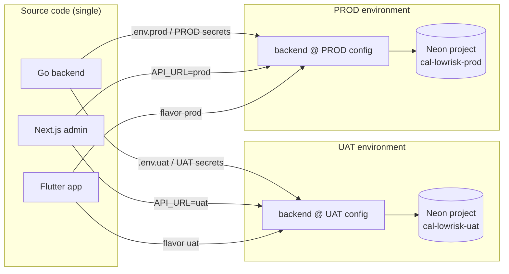
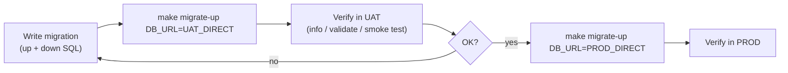

# Environments & Deployment — cal-lowrisk

| Field | Value |
|---|---|
| **Project** | cal-lowrisk |
| **Document** | Environments, configuration & deployment strategy |
| **Version** | 0.1 (Draft) |
| **Status** | Draft — pending review |
| **Author** | Product Owner + Kiro (SA) |
| **Phase** | System Analysis (companion to `architecture.md`) |
| **Last updated** | 2026-10-08 |

> **Process note:** Companion to [`architecture.md`](./architecture.md). Records *where*
> and *how* cal-lowrisk runs: the environments, how one codebase targets each, how config
> and secrets differ, and how migrations are promoted. Everything here stays within
> **free-tier** limits (BRD §7). It is a plan — nothing is provisioned yet.

---

## 1. Core principle — one codebase, many targets

**We do NOT duplicate code per environment.** There is **one** backend codebase, **one**
Next.js codebase, **one** Flutter codebase. What differs between environments is
**configuration (env vars / secrets) and the deploy target** — never the source.



---

## 2. Environments

Two long-lived environments:

| Env | Purpose | Audience |
|---|---|---|
| **UAT** | Integration/testing; validate migrations & features before release. | Us (test accounts, seed data). |
| **PROD** | The "live" environment. | Real usage. |

> Migrations and features always land in **UAT first**, are verified, then promoted to
> **PROD** (BRD-style BA→SA→UX→Dev discipline extended to releases).

---

## 3. Database — Neon (two separate projects)

**Decision:** use **two separate Neon projects**, not two branches of one project.

```text
Neon account
├── project: cal-lowrisk-uat   → database for UAT
└── project: cal-lowrisk-prod  → database for PROD
```

### Why two projects (not two branches)
Neon's **compute quota is scoped per project** (100 CU-hours/project/month on the Free
plan). Two projects therefore give us **two independent 100 CU-hour budgets** and real
"prod vs non-prod" isolation. With a single project + two branches, both environments
would **share one 100 CU-hour budget**, and — per Neon's Free-plan behavior — once the
quota is hit, the **non-primary branch (UAT) is suspended until the next month** while the
primary (PROD) keeps running. Separate projects avoid that coupling entirely.

> Branches still have a place later: within each project we can spin up a short-lived
> branch for a **per-PR preview**, then delete it. That's a feature use case, not a
> long-lived environment.

### Free-tier facts that shape our usage
Source: Neon Free plan docs (see §9). Content rephrased for licensing compliance.

| Fact | Value | Our handling |
|---|---|---|
| Compute | 100 CU-hours / project / month | Two projects = 2× budget; fine for low traffic. |
| Branches | up to 10 / project | Used for PR previews only. |
| Storage | ~0.5–1 GB / project | Ample for MVP. |
| **Auto-suspend** | after **5 min idle** (fixed on Free) | First request after idle = cold start (~hundreds of ms). Clients/health checks must tolerate it; set sane DB connect timeouts. |
| **Connection pooling** | PgBouncer; hostname contains **`-pooler`** | **We MUST use the pooled connection string** and keep the Go pool small. |

### Connection pooling (hard requirement)
Go + GORM opens a pool of real Postgres connections; Neon Free is connection-limited. So:
- Use the **pooled** (`-pooler`) connection string in `DATABASE_URL`.
- Keep the app pool small: e.g. `SetMaxOpenConns(5–10)`, `SetMaxIdleConns(2)`,
  `SetConnMaxLifetime(~5m)`. Tune later.
- For **migrations**, prefer the **direct (non-pooled)** connection string — some
  migration operations don't play well with transaction-mode pooling.

---

## 4. Configuration & secrets (per environment)

Same variables, different values per env. **Secrets are never committed** (BRD §7). Local
dev uses git-ignored `.env` files; CI/CD uses the platform's secret store.

| Variable | UAT | PROD | Notes |
|---|---|---|---|
| `DATABASE_URL` | Neon `cal-lowrisk-uat` **pooled** URL | Neon `cal-lowrisk-prod` **pooled** URL | App runtime (GORM). |
| `DATABASE_URL_DIRECT` | UAT **direct** URL | PROD **direct** URL | Migrations (golang-migrate). |
| `JWT_SECRET` | distinct value | distinct value | Never reuse across envs. |
| `APP_ENV` | `uat` | `prod` | For logging/behavior flags. |
| `REDIS_URL` | *(deferred)* | *(deferred)* | When the summary cache is enabled. |

**Client config:**
- **Next.js admin:** `API_URL` (or `NEXT_PUBLIC_API_URL`) points at the matching backend;
  Vercel maps *preview* → UAT backend, *production* → PROD backend.
- **Flutter:** build **flavors** `uat` / `prod`, each compiled with its API base URL.

**Local files (git-ignored):**
```text
.env            # local dev (your own throwaway Neon project or UAT)
.env.uat        # UAT values (NOT committed)
.env.prod       # PROD values (NOT committed)
environment-variables.example   # committed template with blank values
```

---

## 5. Migrations across environments (golang-migrate)

Same migration files (`migrations/<module>/*.{up,down}.sql`) run against each env — only
the target `DB_URL` changes. Schema is owned by **golang-migrate**, per-module folders,
Makefile-ordered (see `architecture.md` §5.1 and the `add-module` skill).

**Promotion flow (UAT → PROD):**


Rules (carried from the `add-module` skill + migration best practice):
- Always test in **UAT first**; promote to PROD only after it passes.
- Every migration has a paired **`.up.sql` / `.down.sql`**.
- **Never edit an applied migration** — add a new one (checksum/version integrity).
- Use the **direct** (non-pooled) connection string for migrations.
- Seed/reference data via idempotent seed migrations (`ON CONFLICT DO NOTHING`);
  seeded rows use fixed hardcoded UUIDs (see `erd.md` §2).

> Makefile targets accept `DB_URL` so the same `migrate-up`/`migrate-down` run against
> either environment. Exact targets are defined during the Dev phase.

---

## 6. Deploy targets (indicative, free-tier)

Backend hosting isn't finalized; candidates that fit free-tier for a single Go service:

| Component | Candidate host | Env mapping |
|---|---|---|
| Go backend | A free-tier container/app host (TBD during Dev) | Two services (or one service, two configs) → UAT / PROD |
| Next.js admin | **Vercel** (free) | preview → UAT, production → PROD |
| Flutter app | Built artifacts (store/side-load) | flavor uat / prod |
| Database | **Neon** | `cal-lowrisk-uat` / `cal-lowrisk-prod` |

> The backend host is deliberately left open (an §8 decision). The design keeps it
> host-agnostic: anything that runs a Go binary with env vars works.

---

## 7. Release / branch strategy (repo)

Kept lightweight for a solo team (contrast the heavier branch-per-env model in some
enterprise setups):

- **`main`** is the source of truth; no direct commits (branch + PR, per steering).
- Suggested: merging to `main` deploys to **UAT** automatically (CI/CD); **PROD** deploy
  is a **manual promotion/approval** step (a tag or a manually-triggered workflow).
- CI/CD injects per-env secrets from the platform's secret store (GitHub Actions secrets),
  mirroring §4. Never echo secrets into logs.

> This gives us the enterprise *promote* discipline (UAT → approve → PROD) without
> maintaining parallel long-lived code branches.

---

## 8. Open items for review

1. **Backend host:** which free-tier host runs the Go service (and whether UAT+PROD are
   two services or one service with two configs). Needs a short spike in the Dev phase.
2. **PROD promotion trigger:** git tag vs manual workflow dispatch vs environment approval.
3. **Cold-start tolerance:** acceptable first-request latency after Neon auto-suspend; do
   we add a lightweight keep-warm ping on PROD (mindful of the 100 CU-hour budget)?
4. **Local dev DB:** own throwaway Neon project per developer vs sharing UAT.
5. **Seed data for UAT:** scope of seeded catalog/test accounts for UAT validation.

---

## 9. References

- Neon Free plan limits & quotas — https://neon.com/faqs/free-plan-limits-and-quotas
- Neon Free tier compute/branch suspension behavior — https://neon.tech/docs/reference/technical-preview-free-tier/
- Neon connection pooling (PgBouncer, `-pooler` host) — https://neon.com/faqs/postgres-hosting-options-auto-pause-database
- Neon auto-suspend (5-min, fixed on Free) — https://neon.com/faqs/databases-automatically-scale-serverless-environments

> Figures reflect Neon's Free plan as of 2026-10 and may change; verify against the live
> pages above before provisioning.
