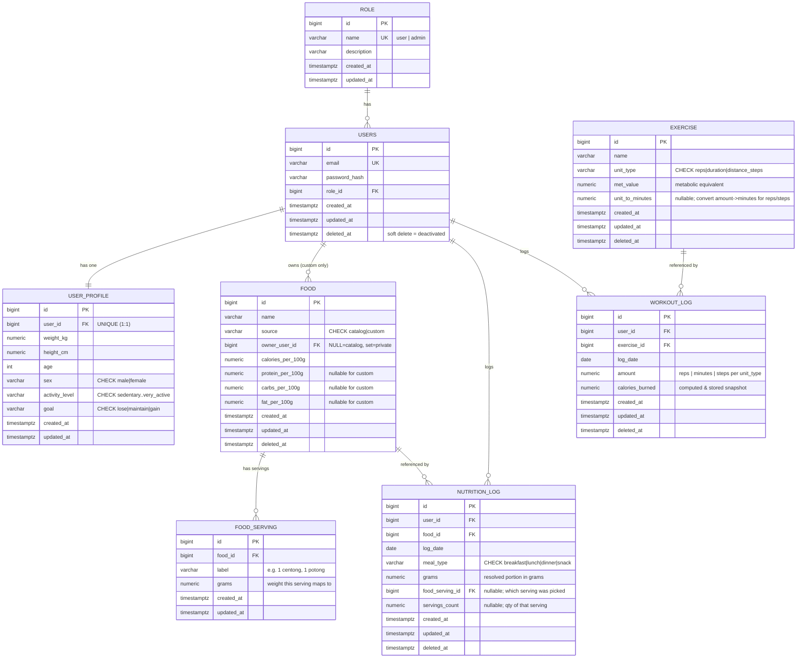

# Entity Relationship Diagram (ERD) — cal-lowrisk

| Field | Value |
|---|---|
| **Project** | cal-lowrisk |
| **Document** | Entity Relationship Diagram (ERD) + data model notes |
| **Version** | 0.1 (Draft) |
| **Status** | Draft — pending review |
| **Author** | Product Owner + Kiro (SA) |
| **Phase** | System Analysis (follows the BRD) |
| **Last updated** | 2026-10-08 |

> **Process note:** This ERD is **derived from the BRD** (`docs/01-business/brd.md`).
> Requirements there are the source of truth; this document translates them into a data
> model. Schema (DDL) is owned by **golang-migrate** SQL migrations (per-module folders) —
> **not** GORM AutoMigrate. GORM is for runtime queries only. See steering `product.md`
> and the `add-module` skill.

---

## 1. Decisions resolved (BRD §10 open questions)

These five questions were deferred from the BRD to this phase. Resolved as follows and
reflected in the model below.

| # | Question (BRD §10) | Decision | Model impact |
|---|---|---|---|
| 1 | Food portion basis | **Hybrid.** Macros stored **per 100 g** (basis of truth, required) + an **optional** `food_serving` table for local household measures (e.g. "1 centong = 100 g"). | New table `food_serving`; user may log in grams or by serving. |
| 2 | Custom food persistence | **Reusable.** Single `food` table; a `source` discriminator (`catalog` / `custom`) + nullable `owner_user_id`. `NULL` owner = system catalog; set = private personal food. | `food.source`, `food.owner_user_id` columns. |
| 3 | Summary computation | **On-the-fly + Cache interface.** Summaries are computed from logs on request; a `Cache` interface (no-op in MVP, Redis later) wraps it. | **No summary table.** Summary is derived, not stored. |
| 4 | Calorie-burn estimation | **MET-based + body weight.** Each exercise stores a `met_value`; `kcal ≈ MET × weight_kg × duration_h`. `unit_type` governs how the logged `amount` maps to an effective duration. | `exercise.unit_type`, `exercise.met_value`. User body weight read from profile. |
| 5 | Daily target formula | **Mifflin-St Jeor** BMR → ×activity multiplier (TDEE) → goal adjustment. Computed **on-the-fly** from profile. | No new columns required (profile already holds inputs); optional target snapshot deferred. |

### Enum strategy (decided)
All enum-like values use **PostgreSQL `CHECK` constraints** (or native enums), **except
`role`**, which the BRD mandates as a first-class **table** (with a seed migration), so new
roles are additive without code changes.

| Field | Representation | Allowed values |
|---|---|---|
| `role` | **Table** `role` (seeded) | `user`, `admin` |
| `user_profile.sex` | CHECK | `male`, `female` |
| `user_profile.activity_level` | CHECK | `sedentary`, `light`, `moderate`, `active`, `very_active` |
| `user_profile.goal` | CHECK | `lose`, `maintain`, `gain` |
| `food.source` | CHECK | `catalog`, `custom` |
| `exercise.unit_type` | CHECK | `reps`, `duration`, `distance_steps` |
| `nutrition_log.meal_type` | CHECK | `breakfast`, `lunch`, `dinner`, `snack` |

---

## 2. Conventions

- **Primary keys:** `BIGINT GENERATED ALWAYS AS IDENTITY` (surrogate `id`). (UUID is an
  option if we later distribute; integers are simpler and cheaper for a monolith MVP.)
- **Shared base columns** on every table (matches the `add-module` base model):
  `created_at TIMESTAMPTZ NOT NULL DEFAULT now()`, `updated_at TIMESTAMPTZ NOT NULL DEFAULT now()`,
  and `deleted_at TIMESTAMPTZ NULL` for **soft delete** where applicable.
- **Timestamps are `TIMESTAMPTZ`** and clean, to leave the path open for future
  streaks/trends (BRD roadmap) without migration.
- **Money/– no money here. Nutrition numbers** use `NUMERIC` for precision (not float):
  calories `NUMERIC(7,2)`, macros `NUMERIC(7,2)` grams, MET `NUMERIC(4,2)`.
- **Soft delete** (`deleted_at`) is used for: `users` (admin activate/deactivate, ADM-5),
  catalog `food`/`exercise`, and user logs (so users can "delete" without hard loss).
- **Module ownership of tables** (migrations live per module):

| Module | Owns tables |
|---|---|
| `user` | `role`, `users`, `user_profile` |
| `food` | `food`, `food_serving` |
| `exercise` | `exercise` |
| `nutrition` | `nutrition_log` |
| `workout` | `workout_log` |
| `summary` | *(none — computed)* |

> **Migration dependency order** (FKs): `user` → `food` → `exercise` → `nutrition` →
> `workout`. This matches the canonical order in the `add-module` skill.

---

## 3. ERD (Mermaid)

---

## 4. Entity notes

### 4.1 `role` (module: user) — seeded master data
First-class entity per BRD §4. Seeded via migration (`user` and `admin`). Keeps the door
open for future roles (Nutritionist/Coach) with no code change (BRD roadmap).
- `name` UNIQUE. (USR-6)

### 4.2 `users` (module: user)
- `email` UNIQUE; `password_hash` only (never store plaintext — NFR §7 security). (USR-1, USR-2)
- `role_id` → `role`. Default assignment = `user` (resolved in service/seed). (USR-6)
- `deleted_at` is how **admin activate/deactivate** works (soft delete, ADM-5). An
  authenticated check must treat `deleted_at IS NOT NULL` as deactivated.

### 4.3 `user_profile` (module: user)
- **1:1 with `users`** (`user_id` UNIQUE). Holds all BMR/TDEE inputs. (USR-3, USR-4)
- `sex`, `activity_level`, `goal` are CHECK-constrained enums.
- These columns are the **sole inputs** to the daily-target computation (decision #5) and
  to body-weight in calorie burn (decision #4). No target is stored (computed on-the-fly).
- > *Optional later:* a target snapshot (`bmr`, `tdee`, `target_calories`) could be added
  > if we want historical summaries to stay stable when a profile changes. Deferred.

### 4.4 `food` (module: food) — catalog + custom in one table
- `source` CHECK (`catalog` | `custom`); `owner_user_id` **NULL = system catalog**, set =
  **private custom food** (decisions #2). (FOOD-1, NUT-4, NUT-5)
- Macros stored **per 100 g** (decision #1). Macros are **nullable** so a custom food can
  be name + calories only (NUT-4). Catalog foods should have full macros (FOOD-1).
- **Privacy / visibility rule (enforce in repository/service):** a user may read
  `source = 'catalog'` **OR** (`source = 'custom'` AND `owner_user_id = :current_user`).
  Admins manage catalog only and must **never** see users' custom foods (BRD §4.1, ADM-6).
- `deleted_at` soft delete so historical logs referencing a removed food still resolve.

### 4.5 `food_serving` (module: food) — optional local measures
- Optional per food (decision #1 / Opsi C). Maps a human label to grams
  (e.g. "1 centong" → 100 g), oriented to Indonesian meals (FOOD-5).
- If a food has no servings, logging falls back to **grams** input. MVP can ship with zero
  servings and add them incrementally — no migration needed.

### 4.6 `nutrition_log` (module: nutrition) — transactional, per user
- References a `food` (catalog or custom). (NUT-1, NUT-2)
- **Portion is always resolved to `grams`** so calorie/macro math is uniform:
  `nutrient = food.nutrient_per_100g × grams / 100` (NUT-3). If the user picked a serving,
  `food_serving_id` + `servings_count` record *how* they chose it, and
  `grams = serving.grams × servings_count` is stored for a stable snapshot.
- `meal_type` CHECK enum (NUT-1). `log_date` is a `DATE` (summaries group by date).
- `deleted_at` → user edit/delete own entries (NUT-6). **User-owned data; admin never
  reads it** (BRD §4.1).

### 4.7 `exercise` (module: exercise) — catalog only (no custom in MVP)
- `unit_type` CHECK (`reps` | `duration` | `distance_steps`). (EXE-1, EXE-5)
- `met_value` drives the burn estimate (decision #4). (EXE-2)
- `unit_to_minutes`: optional conversion factor so non-duration units map to an effective
  duration. For `duration`, `amount` is already minutes (factor = 1 / ignored); for `reps`
  and `distance_steps`, it converts `amount` → minutes before the MET formula.
- Admin CRUD (EXE-4); `deleted_at` soft delete.

### 4.8 `workout_log` (module: workout) — transactional, per user
- References a catalog `exercise`; records `amount` in that exercise's unit. (WRK-1, WRK-2)
- `calories_burned` is computed at write time and **stored as a snapshot**:
  `effective_minutes = amount × unit_to_minutes` (or `amount` when duration);
  `calories_burned ≈ met_value × profile.weight_kg × (effective_minutes / 60)` (WRK-3).
  Storing the snapshot keeps summaries stable even if catalog MET or user weight later
  changes. **User-owned; admin never reads it** (BRD §4.1).

### 4.9 `summary` module — no table
Summaries (daily/weekly/monthly) are **computed on-the-fly** (decision #3) by aggregating
`nutrition_log` (calories in + macros) and `workout_log` (calories out) over a date range,
then comparing against the on-the-fly target (decision #5). A `Cache` interface wraps the
computation (no-op in MVP; Redis/Upstash later) — a **code** concern, no schema. (SUM-1..6)

---

## 5. Computation reference (for the Dev phase)

> Not schema — recorded here so the formulas live with the model that feeds them.

**Daily target (decision #5):**
1. **BMR (Mifflin-St Jeor):**
   - male:  `10 × weight_kg + 6.25 × height_cm − 5 × age + 5`
   - female:`10 × weight_kg + 6.25 × height_cm − 5 × age − 161`
2. **TDEE = BMR × activity multiplier:**
   `sedentary 1.2 · light 1.375 · moderate 1.55 · active 1.725 · very_active 1.9`
3. **Goal adjustment:** `lose = TDEE − 500` · `maintain = TDEE` · `gain = TDEE + 300`
   (deltas are config constants, not stored).

**Calorie burn (decision #4):**
`effective_minutes = (unit_type == duration) ? amount : amount × unit_to_minutes`
`calories_burned ≈ met_value × weight_kg × (effective_minutes / 60)`

**Daily balance:**
`net = calories_in − calories_out` · status vs target → `deficit` / `balanced` / `surplus`.

---

## 6. Traceability (requirement → table/column)

| BRD requirement | Where in model |
|---|---|
| USR-1/2 auth | `users.email`, `users.password_hash` |
| USR-3 body data | `user_profile.*` |
| USR-4 goal | `user_profile.goal` |
| USR-6 role | `role` table + `users.role_id` |
| FOOD-1 macros | `food.*_per_100g` |
| FOOD-2 portion basis | per-100g + `food_serving` |
| NUT-2 catalog or custom | `food.source` + `nutrition_log.food_id` |
| NUT-4 custom food | `food.source='custom'` + `owner_user_id` |
| NUT-5 source tag | `food.source` |
| EXE-1 unit type | `exercise.unit_type` |
| EXE-2 burn data | `exercise.met_value` (+ `unit_to_minutes`) |
| WRK-2 amount | `workout_log.amount` |
| WRK-3 burn | `workout_log.calories_burned` (computed) |
| SUM-1 target | computed (Mifflin-St Jeor), no table |
| SUM-2..5 summaries | computed from logs, no table |
| ADM-5 deactivate | `users.deleted_at` (soft delete) |
| ADM-6 / §4.1 privacy | enforced in service: admin never reads `nutrition_log` / `workout_log` / custom `food` |

---

## 7. Open items for review

1. **PK type:** integer identity (current choice) vs UUID. Integers chosen for MVP
   simplicity; revisit only if we distribute.
2. **Target snapshot:** add `bmr`/`tdee`/`target_calories` to `user_profile` later if we
   want historical summaries immune to profile edits. Deferred.
3. **`unit_to_minutes` for `reps`:** reps→minutes is a coarse approximation. Acceptable for
   MVP (burn is explicitly an estimate, BRD §8.1); revisit if accuracy matters.
4. **Indexes:** add `(user_id, log_date)` indexes on both log tables for summary queries;
   detailed in migrations during the Dev phase.
