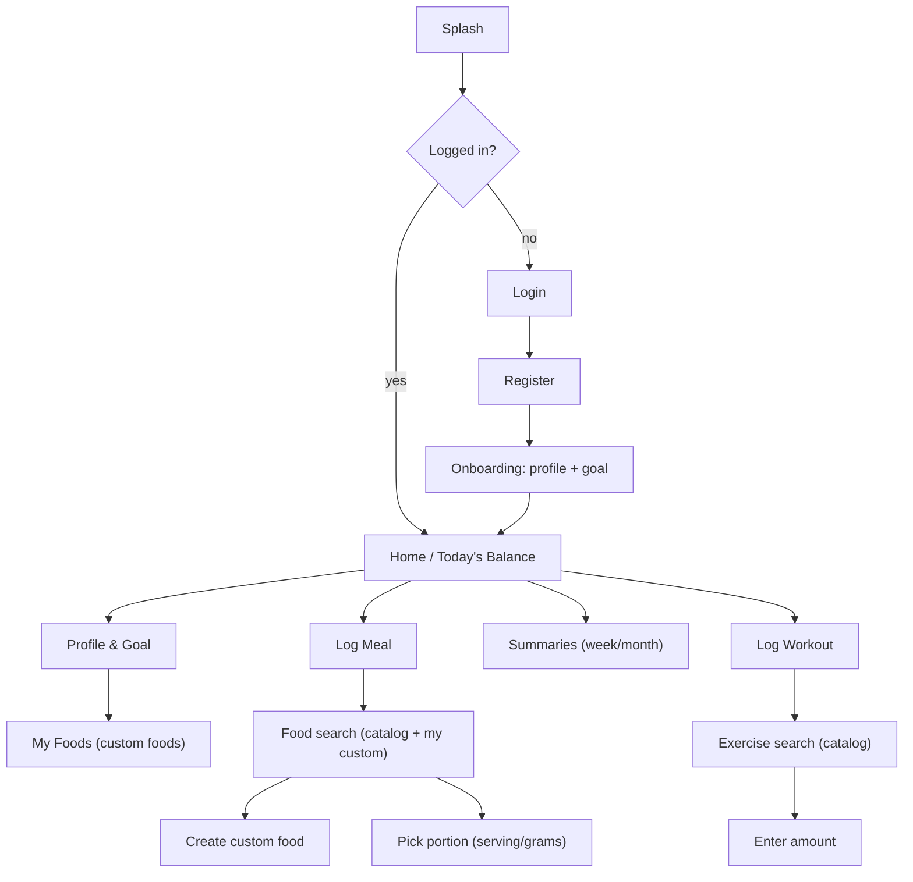
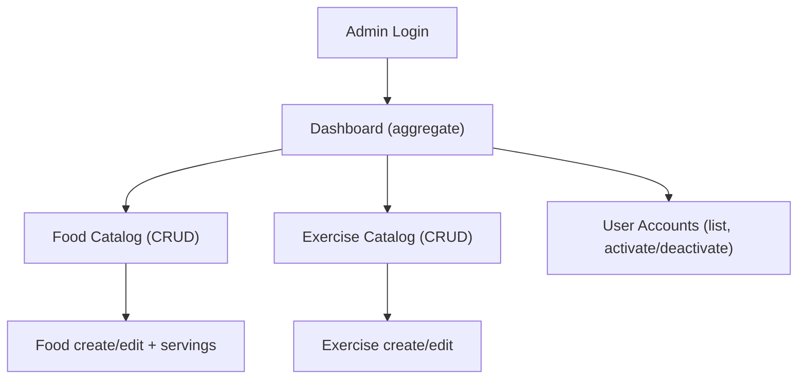
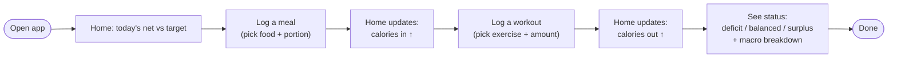
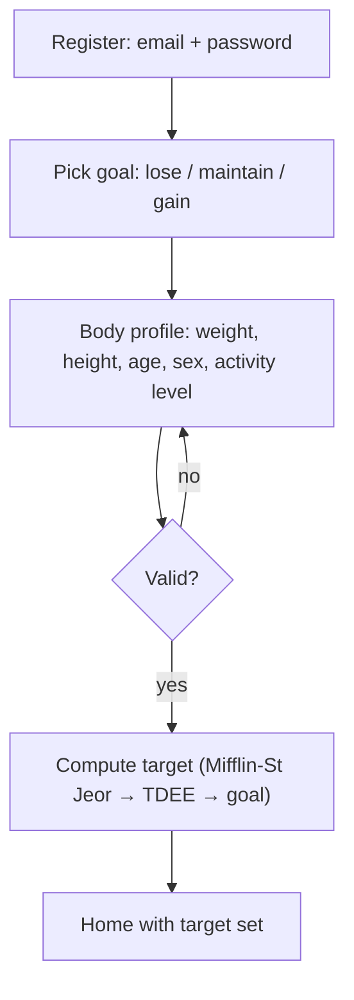
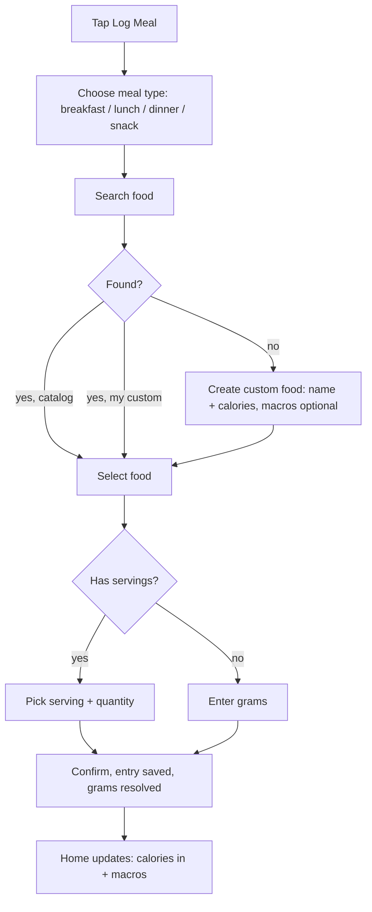
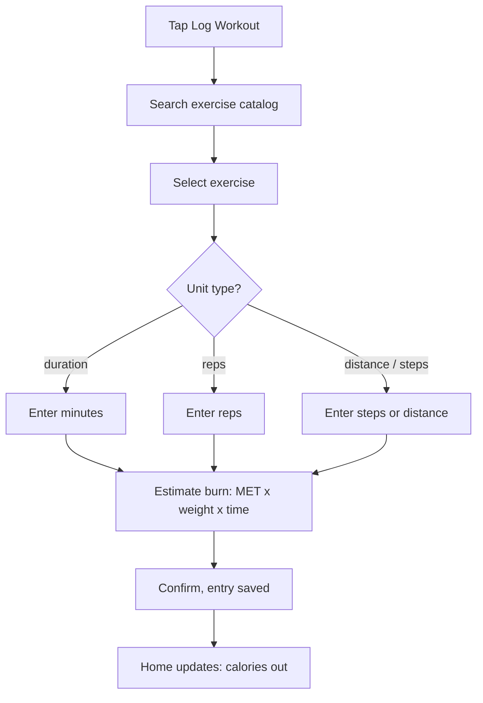
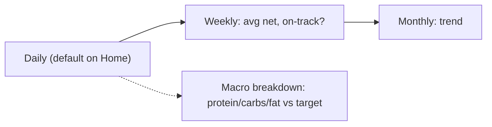
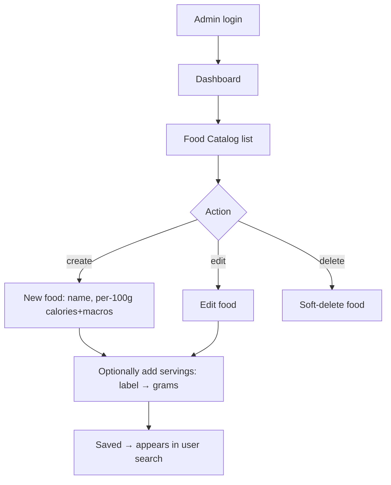
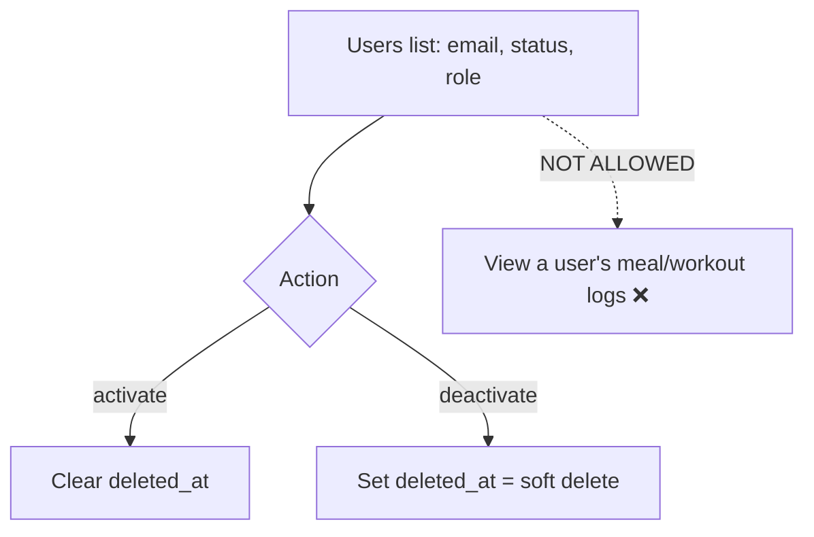

# User Flows & Screen Inventory — cal-lowrisk

| Field | Value |
|---|---|
| **Project** | cal-lowrisk |
| **Document** | UX — user flows, sitemap, screen inventory, low-fi wireframes |
| **Version** | 0.1 (Draft) |
| **Status** | Draft — open items resolved (see §10) |
| **Author** | Product Owner + Kiro (UX) |
| **Phase** | UX (follows the SA phase: `erd.md`, `architecture.md`, `deployment.md`) |
| **Last updated** | 2026-10-08 |

> **Process note:** The UX phase defines *how the product is used* — journeys, screens, and
> interactions — derived from the BRD and the data model. It is **docs-as-code**: flows as
> Mermaid, wireframes as text/ASCII (low-fidelity, intentionally). High-fidelity visual
> design happens next **in Figma** (see §9), using the **screen inventory** here as the
> design brief. No pixel mockups live in this repo; link Figma from `docs/03-ux/` later.

---

## 1. UX principles (from the BRD)

| # | Principle | Source |
|---|---|---|
| P1 | **Clarity over data dumps.** The core question is "am I balanced vs my goal today?" — answer it first, details after. | BRD §2.2 G2, Persona A |
| P2 | **Fast logging.** Logging a meal/workout is the most frequent action; keep it few-taps. | G1 |
| P3 | **Local-first content.** Indonesian foods and household serving sizes feel native. | §3.1, FOOD-5 |
| P4 | **Personalized, not generic.** Everything frames against the user's goal and target. | G4 |
| P5 | **Privacy is visible.** User data is theirs; admins never see individual logs. | §4.1 |
| P6 | **Two distinct clients.** User = Flutter (mobile, log + see balance). Admin = Next.js (web, curate + manage). Don't blur them. | §4 |

---

## 2. Sitemap

### 2.1 User app (Flutter)


### 2.2 Admin web (Next.js)


> **Privacy boundary (P5):** the admin sitemap has **no path** to any individual user's
> meal/workout logs. "User Accounts" shows account info + status only.

---

## 3. Core user journey — the loop (BRD success indicator)

The MVP's heartbeat: **log a meal → log a workout → see today's balance vs goal.**



---

## 4. Detailed flows (User app)

### 4.1 Registration → Onboarding (goal + profile)
First-run sets up everything the target calculation needs (`erd.md` §4.3; USR-1..4).


- **Why goal first, then body data:** goal frames the whole app (P4); body data is the
  numeric input to the target.
- Target is computed on-the-fly (never stored) — see `erd.md` §5 / `architecture.md` §5.4.

### 4.2 Log a meal (most frequent — keep it fast, P2)

- Custom foods are **reusable** and appear in future searches (NUT-7; `erd.md` §4.4).
- Portion always resolves to **grams** under the hood (NUT-3), even if picked by serving.

### 4.3 Log a workout

- No custom exercises in MVP (EXE-5). Burn uses MET + body weight (`erd.md` §4.8).

### 4.4 View summaries (daily / weekly / monthly)

- Daily is the default view (P1); weekly/monthly are tabs/segments.
- All computed on-the-fly from logs (SUM-2..5).

---

## 5. Detailed flows (Admin web)

### 5.1 Catalog curation (food / exercise)

- Exercise catalog mirrors this (name, unit_type, MET). Deletes are soft (`erd.md`).

### 5.2 User account management (within the privacy boundary)

- Deactivate = soft delete (ADM-5). **No screen or API exposes a user's private logs**
  (ADM-6 / P5) — this is a hard architectural invariant, not just a hidden button.

---

## 6. Screen inventory (the Figma design brief)

The concrete list of screens to design. Each note what it must show/do. **This is what you
design in Figma (§9).**

### 6.1 User app (Flutter) — mobile
| # | Screen | Must contain | Key actions |
|---|---|---|---|
| U1 | **Splash / Auth check** | logo | route to Login or Home |
| U2 | **Login** | email, password, link to Register | log in |
| U3 | **Register** | email, password, confirm | continue to onboarding |
| U4 | **Onboarding — Goal** | 3 goal options (lose/maintain/gain), short explainer | select goal |
| U5 | **Onboarding — Profile** | weight, height, age, sex, activity level | compute target, go Home |
| U6 | **Home / Today** | **big balance** (in vs out vs target), status chip (deficit/balanced/surplus), macro mini-bars, quick-add buttons (meal, workout), today's entries list | tap to log; open summaries/profile |
| U7 | **Log Meal — meal type** | breakfast/lunch/dinner/snack picker | choose, go to search |
| U8 | **Food Search** | search box, results (catalog + "my foods" tagged), "Create custom food" CTA | select or create |
| U9 | **Create Custom Food** | name, calories (required), macros (optional) | save (private, reusable) |
| U10 | **Portion Picker** | serving options (if any) + quantity, OR grams input; live calorie/macro preview | confirm |
| U11 | **Log Workout — search** | search box, catalog results | select exercise |
| U12 | **Amount Entry** | input adapts to unit_type (minutes/reps/steps), live burn estimate | confirm |
| U13 | **Summaries** | segmented Daily/Weekly/Monthly; net, target, status, macro breakdown; **daily ring**, **weekly/monthly bar chart** (§10.2) | switch range |
| U14 | **Profile & Goal** | current body data + goal, edit; shows current target; entry point to **My Foods** | edit (recomputes target); open My Foods |
| U15 | **My Foods** | list of the user's reusable custom foods (name, calories, macros); scoped to the user only | edit / delete a custom food (§10.4) |

### 6.2 Admin web (Next.js) — desktop
| # | Screen | Must contain | Key actions |
|---|---|---|---|
| A1 | **Admin Login** | email, password | log in (Admin role only) |
| A2 | **Dashboard** | aggregate stats (total users, popular foods) — **no individual data** | navigate |
| A3 | **Food Catalog** | table (name, calories/100g, macros), search, create button | CRUD |
| A4 | **Food Form** | fields + **servings sub-list** (label → grams) | save |
| A5 | **Exercise Catalog** | table (name, unit_type, MET), create button | CRUD |
| A6 | **Exercise Form** | name, unit_type, MET | save |
| A7 | **User Accounts** | table (email, status, role) — **no logs** | activate/deactivate |

---

## 7. Low-fi wireframes (text) — the two most important screens

Intentionally rough — just layout intent for the Figma brief.

### 7.1 Home / Today (U6) — the screen that answers "am I balanced?" (P1)
```text
┌─────────────────────────────┐
│  cal-lowrisk        [profile]│
│                             │
│      TODAY — Oct 8          │
│   ┌───────────────────┐     │
│   │   NET: -320 kcal   │     │  ← big, the headline
│   │  [ DEFICIT ✓ ]     │     │  ← status chip (color-coded)
│   └───────────────────┘     │
│   in 1850  out 420  tgt 2150│  ← supporting numbers
│                             │
│  Macros                     │
│  P ▓▓▓▓░░  C ▓▓▓░░░  F ▓▓░░░ │  ← vs target
│                             │
│  [ + Log Meal ] [ + Workout]│  ← fast actions (P2)
│                             │
│  Today's entries            │
│  • Nasi goreng   520 kcal   │
│  • Lari 20 min  -180 kcal   │
│  ...                        │
│  [ Daily | Weekly | Month ] │  ← to summaries (U13)
└─────────────────────────────┘
```

### 7.2 Portion Picker (U10) — where logging feels local (P3)
```text
┌─────────────────────────────┐
│ ‹ Back      Nasi Goreng      │
│                             │
│ Portion                     │
│  ( ) 1 piring  (≈ 250 g)    │  ← household servings (P3)
│  ( ) 1 centong (≈ 100 g)    │
│  (•) Grams: [ 180 ] g       │  ← fallback
│                             │
│  Quantity: [ − ] 1 [ + ]    │
│                             │
│  Preview                    │
│   520 kcal  P 12  C 78  F 16│  ← live calc
│                             │
│         [  Add to log  ]    │
└─────────────────────────────┘
```

---

## 8. Cross-cutting interaction notes

- **Cold start (free-tier):** first request after idle may be slow (`deployment.md` §8.3).
  Every data screen needs a **loading state** and a **retry-friendly error state** —
  never a dead white screen. Design these states in Figma, not just the happy path.
- **Empty states:** Home with no entries ("Log your first meal"), empty search, no custom
  foods yet — design them; they're the true first-run experience.
- **Validation inline:** profile numbers, custom-food calories, workout amount — show
  errors next to the field (P1 clarity).
- **Status color system:** deficit / balanced / surplus need a consistent, accessible color
  language (define as tokens in Figma → become theme constants in code).
- **Role separation:** user flows never show admin UI and vice-versa; they are different
  apps (P6).

---

## 9. Handoff to Figma — "ready-for-design" checklist

The screen inventory (§6) is your design brief. To make the later **design → code** step
(via the Figma Power, in the Dev phase) as clean as possible:

- [ ] One Figma file (or two: **Mobile** = U1–U15, **Admin** = A1–A7).
- [ ] Apply the **visual direction & tokens** in §11 (type, color, spacing, radius, icons).
- [ ] **Name each frame** to match the inventory (e.g. `Home / Today`, `Portion Picker`,
      `Food Catalog`) — frame names become screen/component names in code.
- [ ] Use **Auto Layout** — translates far more accurately to Flutter/CSS layout.
- [ ] Define **styles/variables** for the status colors, spacing, and typography — these
      become design tokens / theme constants in code.
- [ ] Build repeated elements as **components** (status chip, entry row, macro bar, table row).
- [ ] Design the **non-happy states** called out in §8 (loading, empty, error).
- [ ] Ensure the file is **accessible to the Figma Power** when we reach the Dev phase.

> You can design manually or use Figma's **Make** to draft — either way the integration
> reads your final design. The cleaner the structure, the less "AI slop" and the higher
> the design-code parity.

---

## 10. Decisions (resolved)

These were open items; now decided. A visual reference (an AI calorie-tracker UI on
Behance) informed them — used as *directional inspiration only*, not copied (see §11).

### 10.1 Mobile navigation — **bottom tab bar + center FAB**
Four tabs with a central **`+` FAB** for quick-add (meal/workout):
`Home` · `Summary` · **`+`** · `Profile`. Matches the tracker mental model and keeps the
most frequent action (logging, P2) one tap away.
- **"My Foods" lives inside Profile** (not its own tab) to keep the bar lean.
- We deliberately do **not** copy the reference's `Recipes` / `ai chat` tabs — out of MVP
  scope (BRD §5.2).

### 10.2 Weekly/monthly visualization — **ring (daily) + bar chart (weekly/monthly)**
- **Daily (Home):** a **circular ring progress** for calories vs target — visually strong
  but using a simple ring, not a custom half-gauge (avoids heavy custom painting).
- **Weekly/monthly:** a **simple bar chart** (e.g. 7 bars for the week) via a lightweight
  lib (`fl_chart`) plus the key numbers (avg net, on-track %).
- **Numbers remain primary (P1);** charts support them. No animated gauges for MVP.

### 10.3 Meal type — **required, with a smart time-of-day default**
`meal_type` is mandatory (it already is `NOT NULL` + CHECK in `erd.md`), but the Log-Meal
screen **pre-selects** it from the current time, and the user can change it:
- rough cutoffs: `< 11:00 breakfast` · `11:00–15:00 lunch` · `15:00–18:00 snack` ·
  `> 18:00 dinner`.
- Best of both: data always populated (clean grouping) with zero friction (P2).

### 10.4 Custom food editing — **yes, a "My Foods" screen (U15)**
A dedicated screen lists the user's reusable custom foods with edit/delete, beyond inline
creation during logging (NUT-7). Reached from **Profile**.
- **Privacy:** the list is always scoped to `owner_user_id = current_user`; admins never
  see it (§4.1 / P5).

### 10.5 Admin dashboard metrics (A2) — **4 stat cards + 1 aggregate list**
Read-only, strictly within the privacy boundary (ADM-4 / ADM-6):
- **Stat cards:** Total users · Active users · Foods in catalog · Exercises in catalog.
- **One list:** "Most-logged foods" (top 5–10) — an **aggregate across users**, never an
  individual's data.
- **No** widget drills into any single user's logs/activity.

---

## 11. Visual direction & design tokens (Figma brief)

Directional guidance for the Figma design, informed by a reference UI but intentionally
**not a copy** — our product has its own scope and feel. Treat these as starting tokens to
refine in Figma, then they become theme constants in code.

### 11.1 Direction (the "feel")
- **Warm, clean, calm.** A warm primary (orange family) on lots of white space; health
  content should feel encouraging, not clinical.
- **Hero number on Home.** The big calories/net figure is the focal point (P1) — supported
  by a progress ring and color-coded status.
- **Color-coded macros.** Protein / Carbs / Fat each get a distinct, consistent accent so
  they're scannable at a glance.
- **Horizontal date strip** on Home for quick day switching.
- **Avoid slop:** no gratuitous gradients/shadows, no fake "AI" flourishes, no unused
  decorative charts. Every element earns its place.

### 11.2 Starting tokens (refine in Figma)
| Token | Suggested starting value | Note |
|---|---|---|
| **Typography** | **Inter** or **Plus Jakarta Sans** | NOT SF Pro (Apple-licensed, iOS-only); pick a cross-platform, Flutter-friendly family. Jakarta Sans reads well for an Indonesian audience. |
| **Primary** | warm orange (e.g. `#F0542D` / `#F37252`) | brand + primary actions, FAB, active states |
| **Macro — protein** | blue (e.g. `#2F80ED`) | consistent everywhere protein appears |
| **Macro — carbs** | green (e.g. `#27AE60`) | |
| **Macro — fat** | amber (e.g. `#F2994A`) | |
| **Status — deficit / balanced / surplus** | define a 3-way accessible palette | must pass contrast; used on the Home status chip |
| **Neutrals / text** | near-black (e.g. `#151313`) + grays | body text, borders, surfaces |
| **Spacing scale** | multiples of 4: 4 / 8 / 12 / 16 / 20 / 24 | reference used 16/20px rhythm |
| **Radius** | generous, soft (e.g. 12–20px cards) | friendly, modern feel |
| **Icons** | one consistent line-style set | clean, even stroke weight |

### 11.3 Explicitly out of scope for design (don't design these)
AI chat, recipe discovery, barcode/photo capture, social — all out of MVP scope (BRD §5.2).
Designing them now would create slop and false expectations.
